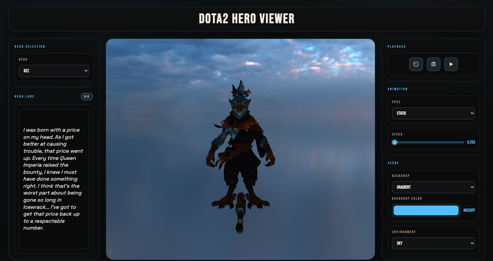
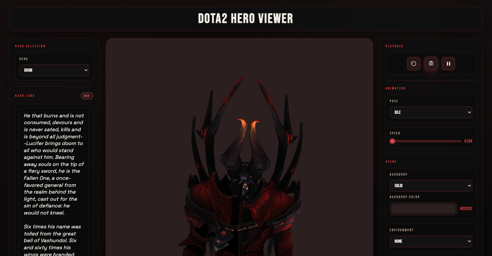

# DotA2 Hero Viewer

A dynamic webapp for exploring Dota 2 hero assets in real time. The UI adapts per-hero (accent colors shift with the selected hero), and the viewer is built for lookdev, pose tuning, and lighting exploration directly in the browser.

## Project idea

Make hero assets easy to browse, compare, and tune without external DCC tools. The viewer emphasizes fast iteration on materials, lighting, and poses while keeping the models and textures close to their original workshop-ready structure.

## Features

- Hero selection for Kez and Doom.
- Pose controls with playback and speed tuning.
- Dynamic UI accents that change with the selected hero.
- Lighting presets plus environment HDR and backdrop controls.
- Local screenshot capture after adjusting pose, environment, and background.
- One-click reset of the scene state.
- Pause/play control for the current animation.
- Texture resolution + fallbacks for Valve FBX + PNG layouts.
- Optional local FBX loading via file picker.

## Live demo

[Try it here:](https://dota2-viz.vercel.app)

## Hero Selected

Kez


Doom


## Tech stack

- Next.js 14
- React 18
- Three.js 0.160
- WebGL renderer with EffectComposer + SSAO pass
- HDR environment maps

## Model storage and rendering

### Storage

Hero textures live under `assets/<hero>/` and are tracked with Git LFS. Each hero folder contains:

- `materials/` textures (PNG/DDS) in Valve layout
- `materials/base/` for shared base textures

Hero FBX models are served as static files from `public/models/`.

See `downsize.md` for the downsizing pipeline and results.

### Serving

The app serves textures via `/assets/*` using a Next.js route handler that streams from the repo `assets/` directory:

- Route: `app/assets/[...path]/route.ts`
- Example: `assets/doom_bringer/materials/doom_head_color.png` is served as `/assets/doom_bringer/materials/doom_head_color.png`

FBX models are served from `public/models/` as static files:

- Example: `public/models/doom_econ.fbx` is served as `/models/doom_econ.fbx`

### Rendering

At runtime the viewer:

1) Loads FBX models with Three.js `FBXLoader`.
2) Resolves textures using `TextureLoader`/`DDSLoader` and Valve material path rules.
3) Applies fallback textures for missing maps and corrects color space for albedo/emissive.
4) Tunes hero materials for readability while preserving original maps.
5) Drives lighting with custom rigs, SSAO, and tone mapping.

## Asset layout

```
assets/
  kez/
    materials/
      base/
      ...
  doom_bringer/
    materials/
      base/
      ...
public/
  models/
    kez_econ.fbx
    doom_econ.fbx
```

## Timeline (from CHANGES.md)

1) 2026-01-27 -> v0 baseline, Git LFS introduced, viewer rebuilt, UI v2 layout
2) 2026-01-27 -> rendering pipeline + playback logic + screenshots added
3) 2026-01-28 -> lighting presets, HDR environment, lore panel, and accent styling
4) 2026-01-28 -> multi-hero scaling and rendering fixes
5) 2026-01-28 -> asset cleanup: Lion and Brewmaster removed
6) 2026-01-28 -> hero selected UI samples + default static pose
7) 2026-01-29 -> downsizing pass for Kez + Doom assets (see downsize.md)

## Quick start Locally

```bash
npm install
npm run dev
```

Open `http://localhost:3000/hero`.

## Sources and attribution

Source reference:

```
https://www.dota2.com/workshop/requirements/
```

All Dota 2 hero assets are credited to Valve Corporation.
